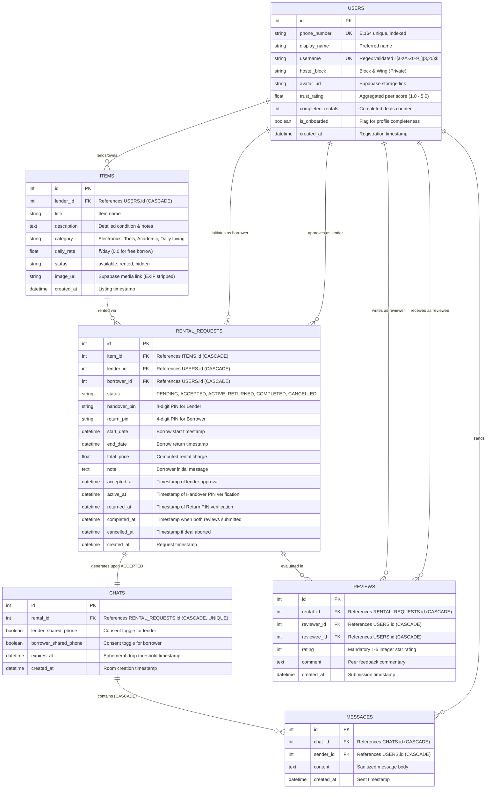

# Database Schema & Entity-Relationship Specification
## HostelShare: University P2P Rental Platform

**Database Engine:** PostgreSQL 15+ (Hosted on Supabase) / SQLite 3.x (Development Fallback)  
**ORM:** SQLAlchemy 2.0  
**Schema Migration Mode:** Automatic Table Generation via `Base.metadata.create_all()`  

---

## 1. Entity-Relationship Diagram (ERD)



---

## 2. Comprehensive Data Dictionary

### 2.1 Table: `users`
Stores student accounts authenticated via phone OTP. Contains identity details, privacy parameters, and peer trust metrics.

| Column Name | Data Type | Constraints | Default | Description |
| :--- | :--- | :--- | :--- | :--- |
| `id` | `INTEGER` | `PRIMARY KEY`, Auto-increment | — | Unique user identifier. |
| `phone_number` | `VARCHAR(20)` | `NOT NULL`, `UNIQUE`, `INDEX` | — | E.164 phone string (e.g., `+919876543210`). Private. |
| `display_name` | `VARCHAR(100)` | `NULLABLE` | `NULL` | Student's preferred public display name. |
| `username` | `VARCHAR(50)` | `UNIQUE`, `INDEX`, `NULLABLE` | `NULL` | Campus handle matching `^[a-zA-Z0-9_]{3,20}$`. |
| `hostel_block` | `VARCHAR(100)` | `NULLABLE` | `NULL` | Hostel wing and room. **Strictly private; omitted from public profiles.** |
| `avatar_url` | `VARCHAR(500)` | `NULLABLE` | `NULL` | Public HTTPS link to user avatar in Supabase Storage. |
| `trust_rating` | `FLOAT` | `NOT NULL` | `5.0` | Running average of peer reviews (1.0 to 5.0). |
| `completed_rentals` | `INTEGER` | `NOT NULL` | `0` | Number of successfully completed transactions. |
| `is_onboarded` | `BOOLEAN` | `NOT NULL` | `FALSE` | Set to `TRUE` after user completes initial profile setup. |
| `created_at` | `TIMESTAMP` | `NOT NULL` | `utcnow()` | Account registration timestamp. |

---

### 2.2 Table: `items`
Catalog of tools, academic books, daily living supplies, and electronics listed for rent or free borrow.

| Column Name | Data Type | Constraints | Default | Description |
| :--- | :--- | :--- | :--- | :--- |
| `id` | `INTEGER` | `PRIMARY KEY`, Auto-increment | — | Unique item identifier. |
| `lender_id` | `INTEGER` | `FOREIGN KEY (users.id) ON DELETE CASCADE` | — | Student who owns and lists the item. |
| `title` | `VARCHAR(200)` | `NOT NULL`, `INDEX` | — | Item title (e.g., "Casio FX-991CW Scientific Calculator"). |
| `description` | `TEXT` | `NULLABLE` | `NULL` | Condition, accessories included, and borrowing terms. |
| `category` | `VARCHAR(50)` | `NOT NULL`, `INDEX` | — | `Electronics`, `Tools`, `Academic`, `Daily Living`. |
| `daily_rate` | `FLOAT` | `NOT NULL` | `0.0` | Rental fee per day in ₹ (`0.0` indicates free peer borrow). |
| `status` | `VARCHAR(20)` | `NOT NULL`, `INDEX` | `'available'` | Listing state: `available`, `rented`, `hidden`. |
| `image_url` | `VARCHAR(500)` | `NULLABLE` | `NULL` | HTTPS URL of photo stored in Supabase (EXIF stripped). |
| `created_at` | `TIMESTAMP` | `NOT NULL` | `utcnow()` | Listing creation timestamp. |

---

### 2.3 Table: `rental_requests`
Governs the core transactional state machine and stores handshake verification PINs.

| Column Name | Data Type | Constraints | Default | Description |
| :--- | :--- | :--- | :--- | :--- |
| `id` | `INTEGER` | `PRIMARY KEY`, Auto-increment | — | Unique rental contract identifier. |
| `item_id` | `INTEGER` | `FOREIGN KEY (items.id) ON DELETE CASCADE` | — | Target item requested. |
| `lender_id` | `INTEGER` | `FOREIGN KEY (users.id) ON DELETE CASCADE` | — | Lending student. |
| `borrower_id` | `INTEGER` | `FOREIGN KEY (users.id) ON DELETE CASCADE` | — | Borrowing student. |
| `status` | `VARCHAR(20)` | `NOT NULL`, `INDEX` | `'PENDING'` | `PENDING`, `ACCEPTED`, `ACTIVE`, `RETURNED`, `COMPLETED`, `CANCELLED`. |
| `handover_pin` | `VARCHAR(10)` | `NULLABLE` | `NULL` | 4-digit secret PIN given to Lender to confirm handover. |
| `return_pin` | `VARCHAR(10)` | `NULLABLE` | `NULL` | 4-digit secret PIN given to Borrower to confirm return. |
| `start_date` | `TIMESTAMP` | `NULLABLE` | `NULL` | Scheduled borrow start date. |
| `end_date` | `TIMESTAMP` | `NULLABLE` | `NULL` | Scheduled return date. |
| `total_price` | `FLOAT` | `NOT NULL` | `0.0` | Total calculated fee (`days * daily_rate`). |
| `note` | `TEXT` | `NULLABLE` | `NULL` | Initial message/note from borrower. |
| `accepted_at` | `TIMESTAMP` | `NULLABLE` | `NULL` | Transition time to `ACCEPTED`. |
| `active_at` | `TIMESTAMP` | `NULLABLE` | `NULL` | Transition time to `ACTIVE` (handover confirmed). |
| `returned_at` | `TIMESTAMP` | `NULLABLE` | `NULL` | Transition time to `RETURNED` (return confirmed). |
| `completed_at` | `TIMESTAMP` | `NULLABLE` | `NULL` | Transition time to `COMPLETED` (reviews complete). |
| `cancelled_at` | `TIMESTAMP` | `NULLABLE` | `NULL` | Transition time to `CANCELLED`. |
| `created_at` | `TIMESTAMP` | `NOT NULL` | `utcnow()` | Creation timestamp. |

---

### 2.4 Table: `chats`
Deal-bound chat room instantiated upon rental acceptance. Implements the Mutual Privacy Shield and ephemeral lifespan.

| Column Name | Data Type | Constraints | Default | Description |
| :--- | :--- | :--- | :--- | :--- |
| `id` | `INTEGER` | `PRIMARY KEY`, Auto-increment | — | Unique chat room identifier. |
| `rental_id` | `INTEGER` | `FOREIGN KEY (rental_requests.id) ON DELETE CASCADE`, `UNIQUE` | — | Exactly one chat room per accepted rental deal. |
| `lender_shared_phone` | `BOOLEAN` | `NOT NULL` | `FALSE` | Has lender consented to unmask phone number. |
| `borrower_shared_phone`| `BOOLEAN`| `NOT NULL` | `FALSE` | Has borrower consented to unmask phone number. |
| `expires_at` | `TIMESTAMP` | `NULLABLE`, `INDEX` | `NULL` | Purge deadline (`return_time + 24h` or `cancellation_time + 72h`). |
| `created_at` | `TIMESTAMP` | `NOT NULL` | `utcnow()` | Timestamp chat room was opened. |

---

### 2.5 Table: `messages`
Individual text communications exchanged between the deal participants.

| Column Name | Data Type | Constraints | Default | Description |
| :--- | :--- | :--- | :--- | :--- |
| `id` | `INTEGER` | `PRIMARY KEY`, Auto-increment | — | Unique message identifier. |
| `chat_id` | `INTEGER` | `FOREIGN KEY (chats.id) ON DELETE CASCADE` | — | Parent chat room. Purged on chat drop. |
| `sender_id` | `INTEGER` | `FOREIGN KEY (users.id) ON DELETE CASCADE` | — | User who authored message. |
| `content` | `TEXT` | `NOT NULL` | — | Message content (max 2000 characters). |
| `created_at` | `TIMESTAMP` | `NOT NULL` | `utcnow()` | Dispatch timestamp. |

---

### 2.6 Table: `reviews`
Peer evaluation submitted after item return. Drives the campus trust score.

| Column Name | Data Type | Constraints | Default | Description |
| :--- | :--- | :--- | :--- | :--- |
| `id` | `INTEGER` | `PRIMARY KEY`, Auto-increment | — | Unique review record ID. |
| `rental_id` | `INTEGER` | `FOREIGN KEY (rental_requests.id) ON DELETE CASCADE` | — | Associated rental transaction. |
| `reviewer_id` | `INTEGER` | `FOREIGN KEY (users.id) ON DELETE CASCADE` | — | Student submitting the review. |
| `reviewee_id` | `INTEGER` | `FOREIGN KEY (users.id) ON DELETE CASCADE` | — | Student receiving the review. |
| `rating` | `INTEGER` | `NOT NULL`, Check `1 <= rating <= 5` | — | Star rating from 1 to 5. |
| `comment` | `TEXT` | `NULLABLE` | `NULL` | Detailed written peer feedback. |
| `created_at` | `TIMESTAMP` | `NOT NULL` | `utcnow()` | Review submission timestamp. |

---

## 3. Referential Integrity & Cascade Deletion Strategy

All foreign key relationships incorporate `ON DELETE CASCADE`:
1. **User Deletion**: Dropping a student account cascades to delete their listings, submitted requests, authored messages, and reviews.
2. **Item Deletion**: Dropping an item cascades to remove all associated rental history and deal chats.
3. **Chat Purging**: Deleting an expired `Chat` row (executed by `purge_ephemeral.py`) automatically purges all child `Message` rows in a single atomic database query without orphaned records.

```sql
-- DDL Verification: Foreign Keys with ON DELETE CASCADE
ALTER TABLE chats 
  ADD CONSTRAINT fk_chats_rental 
  FOREIGN KEY (rental_id) REFERENCES rental_requests(id) ON DELETE CASCADE;

ALTER TABLE messages 
  ADD CONSTRAINT fk_messages_chat 
  FOREIGN KEY (chat_id) REFERENCES chats(id) ON DELETE CASCADE;
```

---

## 4. Indexing & Optimization Strategy

1. **`users.phone_number` & `users.username`**: Unique B-tree indexes for $O(1)$ authentication lookups and profile retrieval.
2. **`items.category` & `items.status`**: Composite indexing candidates for high-performance home feed queries.
3. **`chats.expires_at`**: B-tree index enabling `purge_ephemeral.py` to perform fast range scans (`WHERE expires_at <= NOW()`) on large production tables.
