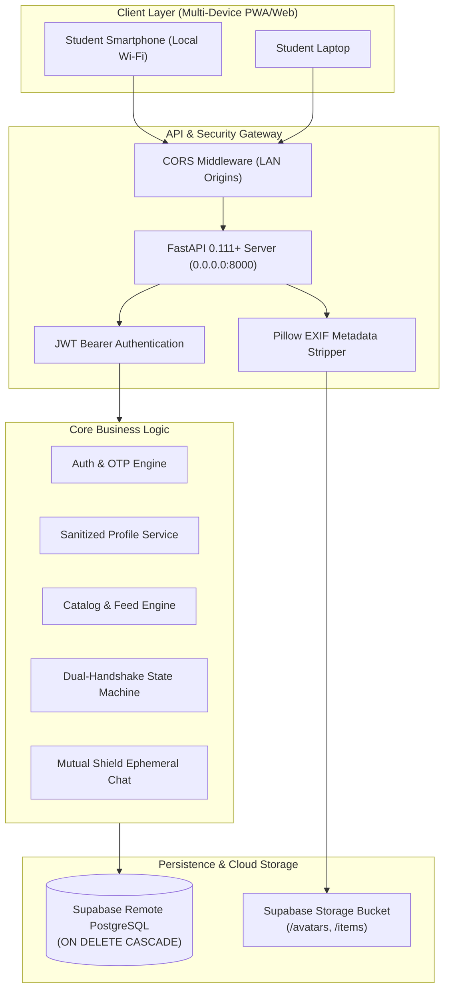
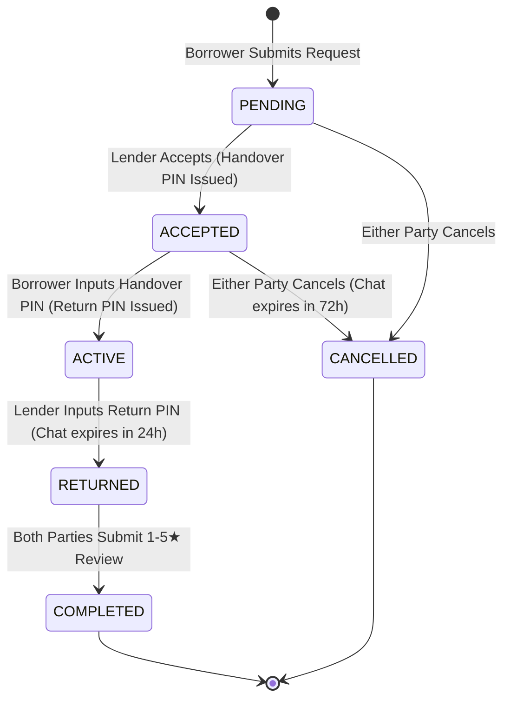

# Software Requirements Specification (SRS)
## For HostelShare: Campus Peer-to-Peer Rental and Utility-Sharing Platform

**Document Version:** 1.0.0  
**Standard:** IEEE Std 830-1998 Compliant  
**Date:** September 2026  
**Status:** Approved for Implementation  

---

## 1. Introduction

### 1.1 Purpose
This Software Requirements Specification (SRS) establishes the complete functional and non-functional requirements for **HostelShare**, an enterprise-grade, privacy-first peer-to-peer (P2P) rental and utility-sharing web application. The platform provides university hostel residents with a secure medium to borrow, rent, and share equipment, utilities, tools, academic books, and electronics within campus boundaries.

### 1.2 Scope
HostelShare addresses campus resource fragmentation where students own redundant single-use items (soldering irons, calculators, cycle pumps, iron presses, lab tools) while other students face temporary shortages. The platform solves this problem by providing:
1. **Low-friction Phone OTP Authentication** with strict campus profile onboarding.
2. **Mutual Privacy Shield Architecture** that prevents deanonymization and harassment by concealing student phone numbers and room/hostel wing locations from public view.
3. **Dual-Handshake State Machine Protocol** using cryptographically generated 4-digit verification PINs to guarantee physical handover and return before states transition.
4. **Ephemeral Deal-Bound Communications** with mutual consent contact reveals and automatic database purging after deal conclusion.
5. **Decentralized Trust Scoring Engine** based on mandatory post-rental 1-5 star peer reviews.

### 1.3 Definitions, Acronyms, and Abbreviations
| Term | Definition |
| :--- | :--- |
| **P2P** | Peer-to-Peer architecture where every user can be both consumer and supplier |
| **Lender** | The student owning an item and offering it for rent or free borrow |
| **Borrower** | The student requesting temporary custody and usage of an item |
| **Handover Handshake**| Verification step where Borrower inputs Lender's secret 4-digit PIN |
| **Return Handshake** | Verification step where Lender inputs Borrower's secret 4-digit PIN |
| **Mutual Consent Shield**| Privacy mechanism where raw phone numbers remain masked until both parties explicitly agree |
| **Ephemeral Chat** | Message stream automatically flagged for deletion 24 hours after completion or 72 hours after cancellation |
| **EXIF** | Exchangeable Image File Format metadata containing GPS coordinates, camera serials, and timestamps |
| **JWT** | JSON Web Token used for stateless RESTful authentication |

---

## 2. Overall Description

### 2.1 Product Perspective
HostelShare operates as a standalone client-server web application. The frontend is built on React 18, bundled with Vite and styled with Tailwind CSS. The backend is an asynchronous REST API built with FastAPI (Python 3.12+), connecting to Supabase Hosted PostgreSQL via SQLAlchemy 2.0 with connection pooling and Supabase Storage for sanitized media files.

### 2.2 User Characteristics
- **Resident Students (Undergraduate & Postgraduate)**: Highly mobile users accessing the service primarily through mobile web browsers on campus Wi-Fi networks. They require instant responsiveness, clear visual cues, zero clutter, and strong privacy guarantees against stalker threats.
- **System Administrators**: Automated cron runners triggering `purge_ephemeral.py` to maintain database hygiene.

### 2.3 Operating Environment
- **Server OS**: Linux / Windows Server / Containerized Docker (Debian slim).
- **Python Runtime**: Python 3.10+ (tested on Python 3.12).
- **Node Runtime**: Node.js v18+ (tested on Node v22).
- **Database**: PostgreSQL 15+ (hosted on Supabase) or local SQLite for offline staging.
- **Client Browsers**: Google Chrome Mobile/Desktop, Apple Safari iOS/macOS, Mozilla Firefox.

### 2.4 Design Constraints
1. **Zero Raw Phone Exposure**: Phone numbers MUST NEVER be exposed in public profiles or API responses without mutual cryptographic consent.
2. **Strict Cascade Deletion**: Foreign key constraints MUST enforce `ON DELETE CASCADE` across `chats` and `messages`.
3. **No Unauthenticated State Transitions**: Transitions in the rental state machine require authenticated calls with valid role enforcement (Lender vs. Borrower).

---

## 3. Specific System Features & Functional Requirements

### 3.1 Functional Requirement 1 (FR-1): Authentication & Onboarding
- **FR-1.1**: The system shall accept an E.164 compliant phone number and dispatch a 6-digit OTP code (default dev mock code: `123456`).
- **FR-1.2**: Upon successful OTP verification, the system shall authenticate existing users or create an un-onboarded shell account.
- **FR-1.3**: New users shall be required to complete onboarding by providing:
  - Preferred Display Name (2–100 chars)
  - Unique Username conforming to regular expression `^[a-zA-Z0-9_]{3,20}$`
  - Hostel Block / Wing (e.g., "Wing B, Block 4")
  - Optional Avatar Image
- **FR-1.4**: The system shall issue a signed HMAC-SHA256 JWT access token valid for 7 days.

### 3.2 Functional Requirement 2 (FR-2): Privacy-Shielded Profiles
- **FR-2.1**: The endpoint `/u/:username` shall return the user's public profile strictly containing:
  - Display Name
  - Unique `@username`
  - Avatar URL
  - Aggregated Trust Rating (1.0 to 5.0)
  - Completed Rentals Count
  - List of active available listings
- **FR-2.2 (SECURITY CRITICAL)**: The public profile endpoint shall **NEVER** serialize or leak the user's phone number, room number, or hostel wing.

### 3.3 Functional Requirement 3 (FR-3): Item Catalog & Feed
- **FR-3.1**: Users shall create listings specifying: Title, Description, Category (`Electronics`, `Tools`, `Academic`, `Daily Living`), Daily Rental Rate (₹0 for free borrows or positive float), and Photo.
- **FR-3.2**: Uploaded photos shall be processed server-side to strip all EXIF metadata before storage in Supabase Storage (`hostelshare-media` bucket).
- **FR-3.3**: The home feed shall support dynamic multi-parameter filtering:
  - Category selector
  - Free vs. Paid toggle (`daily_rate == 0.0`)
  - Availability status (`available` vs `rented`)
  - Full-text search on title and description.

### 3.4 Functional Requirement 4 (FR-4): Dual-Handshake State Machine
- **FR-4.1 (Request)**: A borrower creates a rental request with dates and optional note. Status is initialized to `PENDING`.
- **FR-4.2 (Acceptance)**: The lender accepts the request. The system transitions status to `ACCEPTED`, provisions a 4-digit numeric Handover PIN (visible solely to the lender), marks the item `rented`, and opens the deal chat room.
- **FR-4.3 (Handover)**: Upon physical meeting, the lender communicates the Handover PIN. The borrower submits the PIN via `/rentals/{id}/verify-handover`. The system verifies equality, sets status to `ACTIVE`, and provisions a secret 4-digit Return PIN (visible solely to the borrower).
- **FR-4.4 (Return)**: Upon return, the borrower communicates the Return PIN. The lender submits the PIN via `/rentals/{id}/verify-return`. The system verifies equality, sets status to `RETURNED`, restores item status to `available`, and schedules chat expiration for `now + 24 hours`.
- **FR-4.5 (Cancellation)**: Either party can cancel a `PENDING` or `ACCEPTED` request. Status transitions to `CANCELLED`, item availability is restored, and chat expiration is scheduled for `now + 72 hours`.

### 3.5 Functional Requirement 5 (FR-5): Mutual Trust Scoring
- **FR-5.1**: Once an item is `RETURNED`, both parties are prompted to submit a mandatory 1-to-5 star rating and review comment.
- **FR-5.2**: Upon review submission, the counterparty's cumulative trust rating is updated:
  $$\text{Trust Rating} = \frac{\sum_{i=1}^{N} \text{Rating}_i}{N}$$
- **FR-5.3**: When both reviews are submitted, status transitions to `COMPLETED` and both parties' `completed_rentals` count is incremented by 1.

### 3.6 Functional Requirement 6 (FR-6): Ephemeral In-App Chat & Phone Shield
- **FR-6.1**: A deal-specific chat room is instantiated as soon as the rental transitions to `ACCEPTED`.
- **FR-6.2**: Phone numbers in chat headers are masked by default (e.g., `+91 ••••• ••123`).
- **FR-6.3**: Either party can click "Share Phone Number". The counterparty's full phone number is unveiled **if and only if both parties have granted consent**.
- **FR-6.4**: Expired chats (`expires_at <= current_timestamp`) are purged along with all messages by `scripts/purge_ephemeral.py`.

---

## 4. External Interface Requirements

### 4.1 User Interfaces
The user interface is responsive across viewport widths from 320px (mobile) to 2560px (ultra-wide desktop).
- High visual hierarchy using Tailwind CSS typography and glassmorphic cards.
- Intuitive color semantics: Emerald for Available/Active, Amber for Pending/Return, Violet for Primary actions, Rose for Danger/Cancelled.
- Integrated QR code displayed during local Vite boot for instant camera-scan mobile pairing.

### 4.2 Software Interfaces
- **Supabase PostgreSQL**: Configured via connection string format:
  `postgresql+psycopg2://postgres:[PASSWORD]@[HOST]:5432/postgres`
- **Supabase Storage**: Authenticated REST API client uploading to public bucket `hostelshare-media`.

---

## 5. Non-Functional Requirements

### 5.1 Security
- **NFR-S1**: All user passwords or OTPs are not stored in plaintext. Mock dev OTP `123456` is strictly constrained to development settings.
- **NFR-S2**: JWT tokens are signed using SHA-256 HMAC and verified on all protected routes.
- **NFR-S3**: Uploaded media is scanned and stripped of EXIF tags using Pillow to prevent physical location tracking from camera geolocation tags.

### 5.2 Privacy & Anonymity
- **NFR-P1**: Public profile API serializers strictly exclude sensitive address data (`hostel_block`, room numbers) and phone numbers.
- **NFR-P2**: In-app chat messages are ephemeral and permanently removed when `purge_ephemeral.py` runs after the retention period.

### 5.3 Reliability & Availability
- **NFR-R1**: Database foreign keys enforce referential integrity and cascading deletes (`ON DELETE CASCADE`).
- **NFR-R2**: Database connection pool pre-pings connections to prevent stale socket errors.

### 5.4 Performance
- **NFR-P1**: API endpoint response time shall not exceed 150ms under typical campus load (50 concurrent users).
- **NFR-P2**: Image payload size is optimized to under 500 KB through Pillow JPEG re-compression.

---

## 6. University Course Verification Matrix

| Requirement ID | Description | Verified By | Test Status |
| :--- | :--- | :--- | :--- |
| **FR-1** | Phone OTP & JWT Auth | Unit & Integration Test | Automated |
| **FR-2** | Sanitized Public Profile (`/u/:username`) | Privacy Schema Test | Automated |
| **FR-3** | Item Feed & Multi-Filter Query | Query Filter Test | Automated |
| **FR-4** | Dual-Handshake Protocol (Handover/Return) | State Machine Test | Automated |
| **FR-5** | Review & Trust Score Recalculation | Review Math Test | Automated |
| **FR-6** | Mutual Phone Shield & Ephemeral Purge | Script & Chat Test | Automated |
| **NFR-S3**| EXIF Metadata Removal | Pillow Image Test | Automated |
