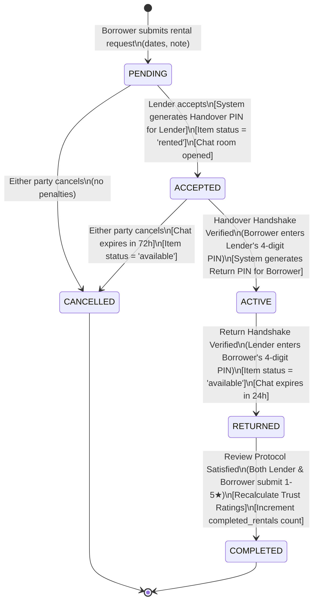
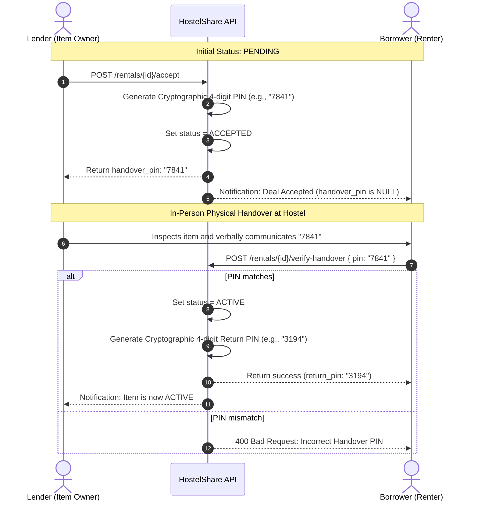
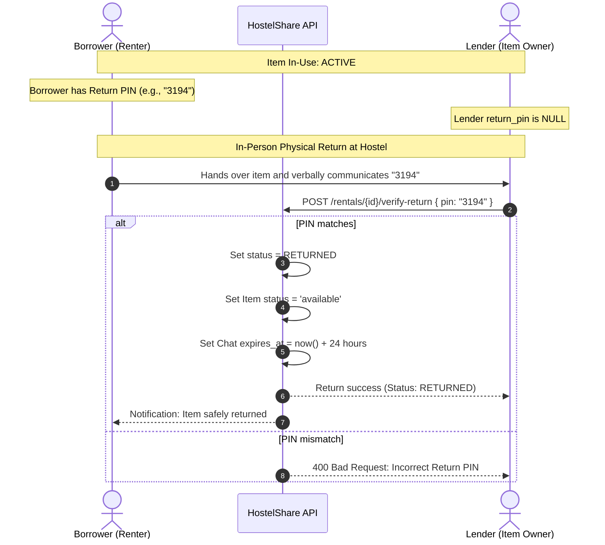

# Rental State Machine & Dual Handshake Protocol
## Technical Specification

**Author:** HostelShare Core Architecture Team  
**Specification Version:** 1.0  
**Scope:** Transactional Lifecycle, Cryptographic PIN Handshakes, Ephemeral Retention Policies  

---

## 1. State Machine Overview

The HostelShare transaction engine implements a finite state machine (FSM) designed to eliminate fraud, dispute ambiguity, and physical theft in campus environments. The core design principle is **Zero-Trust Physical Verification**: neither money nor status transitions can occur without reciprocal verification in the real world.

### 1.1 State Taxonomy

| State | Name | Description | Transitions Allowed To |
| :--- | :--- | :--- | :--- |
| **S0** | `PENDING` | Request initiated by borrower; awaiting lender approval | `ACCEPTED`, `CANCELLED` |
| **S1** | `ACCEPTED` | Lender approved; Handover PIN issued to Lender; Chat opened | `ACTIVE`, `CANCELLED` |
| **S2** | `ACTIVE` | Handover PIN verified; Item in borrower custody; Return PIN issued | `RETURNED` |
| **S3** | `RETURNED` | Return PIN verified; Item restored to lender; Chat countdown (24h) | `COMPLETED` |
| **S4** | `COMPLETED` | Both peer reviews submitted; Trust scores updated | Terminal |
| **S5** | `CANCELLED` | Deal aborted prior to physical handover; Chat countdown (72h) | Terminal |

---

## 2. State Transition Diagram



---

## 3. The Dual Handshake Verification Protocol

### 3.1 Phase 1: Handover Handshake (Lender $\to$ Borrower)



#### Invariants & Security Rules:
- **PIN Isolation**: The `handover_pin` is stored in the database but **only serialized in responses to the Lender**. The Borrower's API response has `handover_pin = null`.
- **Physical Proximity Assurance**: The borrower cannot obtain the PIN without physically meeting the lender and inspecting the item in person.
- **Atomic Activation**: The transition to `ACTIVE` marks the exact legal custody transfer.

---

### 3.2 Phase 2: Return Handshake (Borrower $\to$ Lender)



#### Invariants & Security Rules:
- **Role Inversion**: During return, the direction of trust inverts. The Borrower holds the secret `return_pin`. The Lender must enter it to acknowledge receipt of the undamaged item.
- **Automatic Item Relisting**: Item availability is automatically restored from `'rented'` to `'available'`.
- **Chat Retention Clock Starts**: The chat room's `expires_at` is stamped with $\text{now} + 24\text{ hours}$.

---

## 4. Post-Return Review Protocol & Trust Engine

### 4.1 Peer Review Submission
Once a rental enters `RETURNED` status, both parties are invited to evaluate their counterparty:
- Rating: Integer $\in [1, 5]$
- Optional written comment

### 4.2 Mathematical Trust Score Recalculation
Let $U$ be the user being reviewed (reviewee). Let $\mathcal{R}_U = \{r_1, r_2, \dots, r_k\}$ be all previously received star ratings, and $r_{\text{new}}$ be the newly submitted rating.

$$\text{Trust Rating}(U) = \frac{\sum_{i=1}^{k} r_i + r_{\text{new}}}{k + 1}$$

The result is rounded to 2 decimal places and updated immediately in `users.trust_rating`.

### 4.3 Completion Convergence
- After both Lender and Borrower have submitted their reviews:
  1. Transaction status transitions to `COMPLETED`.
  2. The timestamp `completed_at` is recorded.
  3. `users.completed_rentals` is incremented by 1 for both users.

---

## 5. Ephemeral Retention & Deletion Timeline

```mermaid
gantt
    title Deal Lifespan & Ephemeral Chat Retention Policy
    dateFormat  X
    axisFormat %s

    section Active Deal
    Pending to Accepted      :active, 0, 50
    Handover to Return (Active) :crit, 50, 150
    
    section Completed Deal
    Item Returned            :done, 150, 151
    Reviews & Completion     :done, 151, 160
    Chat Retention Window (24h) :active, 150, 250
    Purge Expired Chat Script:milestone, 250, 250

    section Cancelled Deal
    Deal Cancelled           :crit, 50, 51
    Chat Retention Window (72h) :active, 50, 220
    Purge Expired Chat Script:milestone, 220, 220
```



- **Completed Transactions**: Deal chat expires at $\text{returned\_at} + 24\text{ hours}$. This allows students to coordinate post-return item recovery (e.g. forgotten cables or left-behind items).
- **Cancelled Transactions**: Deal chat expires at $\text{cancelled\_at} + 72\text{ hours}$. This preserves dispute communication logs for 3 days before automated purge.
- **Purge Execution**: Standalone scheduled task `purge_ephemeral.py` issues:
  ```sql
  DELETE FROM chats WHERE expires_at IS NOT NULL AND expires_at <= NOW();
  ```
  Cascading delete cleans all child rows in `messages`.
